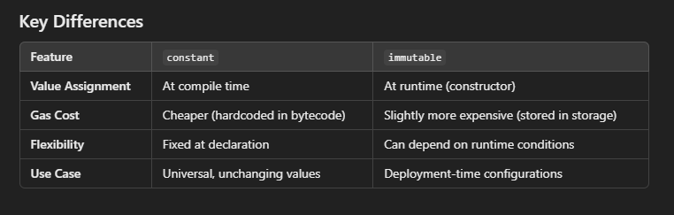

## ✔️ 01. Hello World

```solidity
// SPDX-License-Identifier: MIT

pragma solidity 0.8.28;

contract HelloWorld {
    string public greet = "Hello World!";
}
```

👉 Takeaways:

- [SPDX License Identifier](https://spdx.org/licenses/)
- Specify the Solidity version in a pragma
- Simplest example of a smart contract returning a string

## ✔️ 02. First App

```solidity
// SPDX-License-Identifier: MIT
pragma solidity 0.8.28;

contract Counter {
    uint256 public count;

    // Function to get the current count
    function get() public view returns (uint256) {
        return count;
    }

    // Function to increment count by 1
    function inc() public {
        count += 1;
    }

    // Function to decrement count by 1
    function dec() public {
        // This function will fail if count = 0
        count -= 1;
    }
}
```

👉 Takeaways:

- A `Counter` contract with 1 state variable and 3 functions
- Notice the `public` and `view` keywords
- Notice you get an error if you try to decrement when count is 0

## ✔️ 03. Primitive Data Types

```solidity
// SPDX-License-Identifier: MIT
pragma solidity 0.8.28;

contract Primitives {
    bool public boo = true;

    /*
    uint stands for unsigned integer, meaning non negative integers
    different sizes are available
        uint8   ranges from 0 to 2 ** 8 - 1
        uint16  ranges from 0 to 2 ** 16 - 1
        ...
        uint256 ranges from 0 to 2 ** 256 - 1
    */
    uint8 public u8 = 1;
    uint256 public u256 = 456;
    uint256 public u = 123; // uint is an alias for uint256

    /*
    Negative numbers are allowed for int types.
    Like uint, different ranges are available from int8 to int256

    int256 ranges from -2 ** 255 to 2 ** 255 - 1
    int128 ranges from -2 ** 127 to 2 ** 127 - 1
    */
    int8 public i8 = -1;
    int256 public i256 = 456;
    int256 public i = -123; // int is same as int256

    // minimum and maximum of int
    int256 public minInt = type(int256).min;
    int256 public maxInt = type(int256).max;

    address public addr = 0xCA35b7d915458EF540aDe6068dFe2F44E8fa733c;

    /*
    In Solidity, the data type byte represent a sequence of bytes.
    Solidity presents two type of bytes types :

     - fixed-sized byte arrays
     - dynamically-sized byte arrays.

     The term bytes in Solidity represents a dynamic array of bytes.
     It’s a shorthand for byte[] .
    */
    bytes1 a = 0xb5; //  [10110101]
    bytes1 b = 0x56; //  [01010110]

    // Default values
    // Unassigned variables have a default value
    bool public defaultBoo; // false
    uint256 public defaultUint; // 0
    int256 public defaultInt; // 0
    address public defaultAddr; // 0x0000000000000000000000000000000000000000
}

```

👉 Takeaways:

- Common primitive data types in Solidity: `bool`, `uint256`, `int256` and `address`
- `uint` is an alias for `uint256`
- `uint` goes from `uint8` to `uint256` in increments of 8
- These line give you the minimum and maximum allowed values:
  - `int256 public minInt = type(int256).min;`
  - `int256 public maxInt = type(int256).max;`
- Review the default values of unassigned variables
- Start to notice the `bytes` type.

## ✔️ 04. Variables

3 types of variables in Solidity:

- **local**: Declared inside a function and **not stored in blockchain**.
- **state**: Declared outside a function and **usually stored in blockchain** (transient storage introduced recently).
- **global**: Provides information about the blockchain.

```solidity
// SPDX-License-Identifier: MIT
pragma solidity 0.8.28;

contract Variables {
    // State variables are stored on the blockchain.
    string public text = "Hello";
    uint256 public num = 123;

    function doSomething() public {
        // Local variables are not saved to the blockchain.
        uint256 i = 456;

        // Here are some global variables
        uint256 timestamp = block.timestamp; // Current block timestamp
        address sender = msg.sender; // address of the caller
    }
}
```

👉 Takeaways:

- `local`, `state` and `global` variables and their differences.

## ✔️ 05. Constants

Constants are variables that cannot be modified. Using constants can save gas cost.

```solidity
// SPDX-License-Identifier: MIT
pragma solidity 0.8.28;

contract Constants {
    // coding convention to uppercase constant variables
    address public constant MY_ADDRESS =
        0x777788889999AaAAbBbbCcccddDdeeeEfFFfCcCc;
    uint256 public constant MY_UINT = 123;
}
```

👉 Takeaways:

- The `constant` keyword.
- Added my own example in Remix with 17 variables:
  - When made _constant_ gas was 328497.
  - When not made _constant_ gas was 770712. 🫡

## ✔️ 06. Immutable

Immutable variables are like constants. Values of immutable variables can be set inside the constructor but cannot be modified afterwards.

```solidity
// SPDX-License-Identifier: MIT
pragma solidity ^0.8.26;

contract Immutable {
    // coding convention to uppercase constant variables
    address public immutable MY_ADDRESS;
    uint256 public immutable MY_UINT;

    constructor(uint256 _myUint) {
        MY_ADDRESS = msg.sender;
        MY_UINT = _myUint;
    }
}
```

Key differences between `constant` and `immutable`:



❓ When would you use `constant` and when `immutable`?

- Use `constant` when the value is known at compile time and will never change and you want to minimize storage usage and save gas.
- Use `immutable` when value is only known at runtime and depends on deployment-time parameters.

👉 Takeaways:

- Learn the difference between `constant` and `immutable`.
